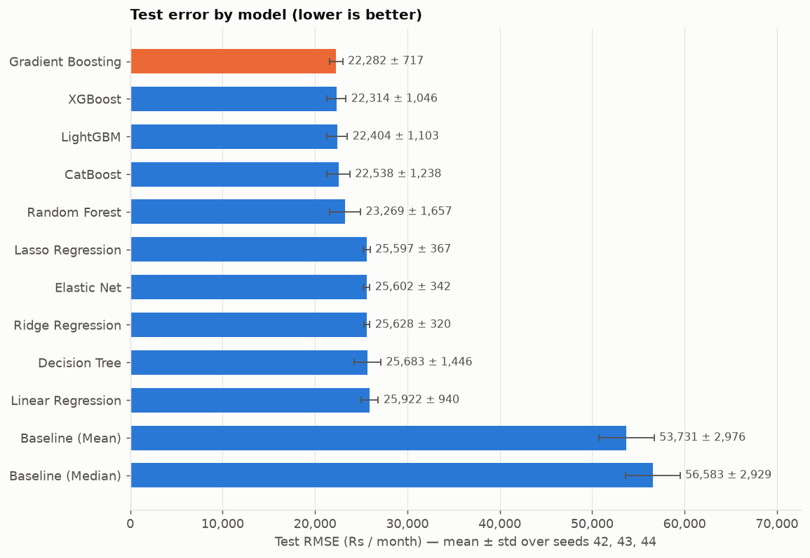
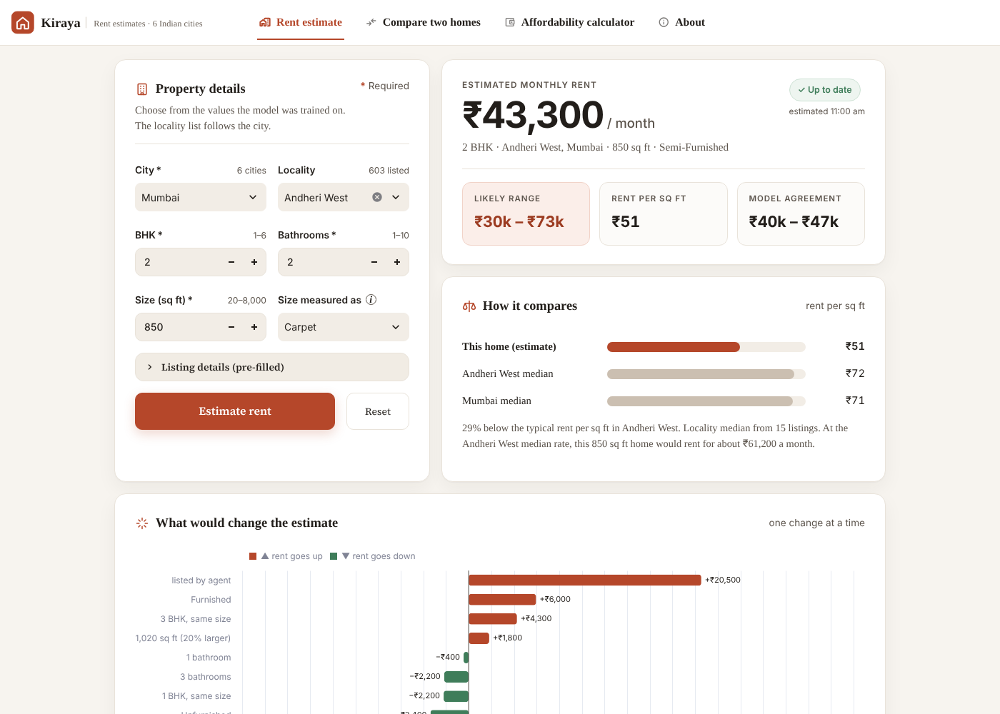
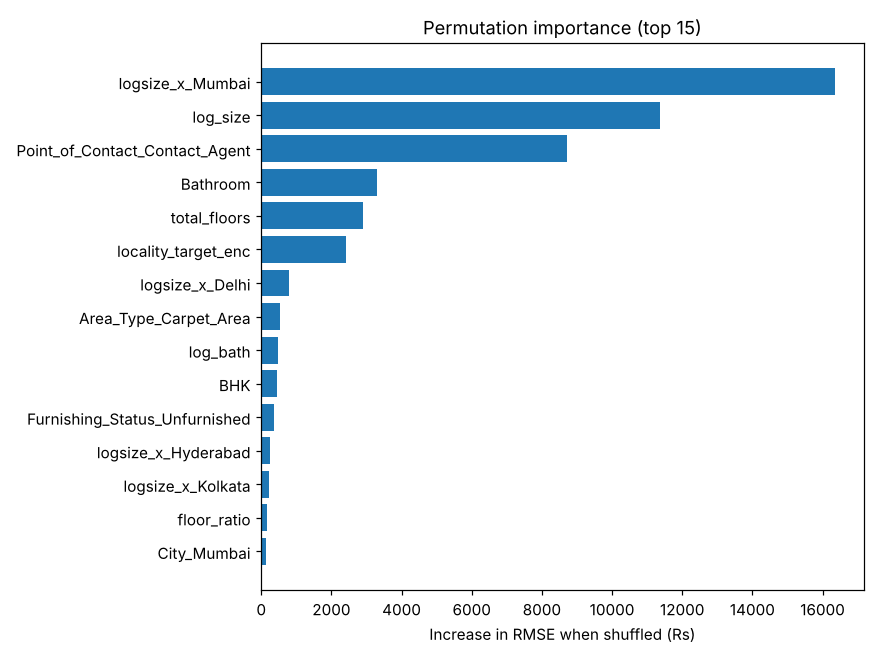
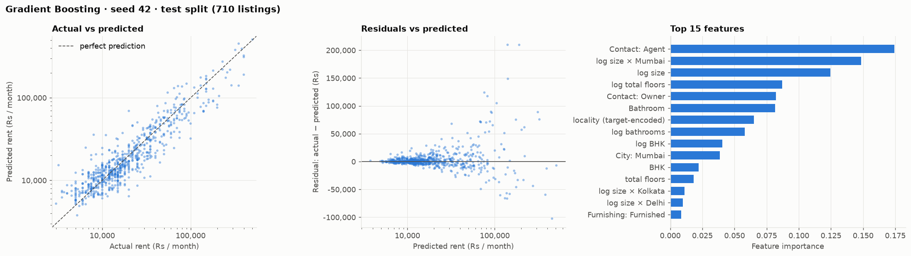

# House Rent Prediction

Predicting the monthly rent of flats and houses in six Indian cities from their listing details — thirteen models
(including a locality × size rule of thumb) compared fairly on identical data, three random seeds each, with no data
leakage.

**Final model: Gradient Boosting — test RMSE ₹22,077 ± 532, typical error (MAE) ₹9,158 a month, median error 20.9%
of the rent, R² 0.83**, averaged over three different train/validation/test splits. The honest benchmark is the rule
of thumb a person would use — the locality's median rent per sq ft × size — which scores ₹31,953 RMSE and a 26.9%
median error: the model cuts RMSE by 31% and the median error by 6 points. The top three boosting models are
statistically tied on RMSE; Gradient Boosting has the lowest MAE among them.



## The app — Kiraya



A Streamlit app on top of the final model, with four pages in the top bar:

- **Rent estimate** — describe a home (city, locality, BHK, bathrooms, size and how it was measured; furnishing,
  who listed it and preferred tenants under *Listing details*) and press **Estimate rent**. The result card shows the monthly rent,
  the **likely range** (the middle 80% of actual ÷ predicted ratios for test homes in the same predicted-price band —
  empirical, not a formal prediction interval), rent per sq ft and how far the three seed models agree. Below it:
  **how it compares** with the locality and city medians, and **what would change the estimate** (the same home
  furnished, 20% larger, agent-listed, …). Changing any input marks the result *Outdated* and fades it until it is
  recalculated; **Reset** brings back the example home. Inputs are kept when you switch pages.
- **Compare two homes** — two homes side by side and how far apart their rents are.
- **Affordability calculator** — check the latest estimate (or any rent) against your take-home income: the share
  going to housing against a limit you choose (30% by default), what's left, the most rent within that limit, and two
  charts — where your income goes, and the likely-low / estimate / likely-high rents against your budget.
- **About** — the study at a glance, why Gradient Boosting was chosen, MAE / RMSE / R², a leaderboard of all models,
  and where the model goes wrong: a residual histogram and actual vs predicted.

Inputs are limited to the ranges in the data; an unknown locality, defaults assumed and similar cases are explained in
a notes bar, and invalid input or missing or outdated model files get a clear message instead of a crash.

```bash
python run_all.py                    # once: builds models/final_model.joblib and models/input_schema.json
streamlit run app/streamlit_app.py   # opens http://localhost:8501
```

## Results

Mean ± standard deviation over seeds 42, 43 and 44 (full table with train, CV and validation errors:
[`reports/results.csv`](reports/results.csv)). Errors are in rupees per month; lower is better. **Median % error** is
the typical miss relative to the home's own rent (half the predictions are closer) — unlike RMSE in rupees, it is not
dominated by a few very expensive homes.

| Model | Test RMSE | Test MAE | Median % error | Test R² | CV RMSE (train) |
|---|--:|--:|--:|--:|--:|
| LightGBM | 22,012 ± 787 | 9,359 ± 397 | 21.5 ± 0.8 | 0.83 ± 0.02 | 28,806 ± 2,315 |
| **Gradient Boosting** (final) | **22,077 ± 532** | **9,158 ± 369** | **20.9 ± 1.0** | **0.83 ± 0.02** | 28,809 ± 2,248 |
| XGBoost | 22,587 ± 1,562 | 9,355 ± 347 | 20.9 ± 1.0 | 0.82 ± 0.03 | 29,899 ± 2,065 |
| CatBoost | 22,874 ± 1,061 | 9,386 ± 265 | 20.8 ± 0.5 | 0.82 ± 0.02 | 30,520 ± 2,768 |
| Random Forest | 23,485 ± 1,589 | 9,906 ± 431 | 22.6 ± 0.7 | 0.81 ± 0.02 | 30,696 ± 2,243 |
| Decision Tree | 25,059 ± 1,173 | 10,506 ± 643 | 24.2 ± 1.1 | 0.78 ± 0.01 | 31,136 ± 891 |
| Elastic Net | 25,075 ± 622 | 10,357 ± 127 | 22.5 ± 1.0 | 0.78 ± 0.02 | 32,182 ± 1,687 |
| Lasso Regression | 25,085 ± 658 | 10,362 ± 115 | 22.5 ± 1.1 | 0.78 ± 0.02 | 32,173 ± 1,663 |
| Ridge Regression | 25,146 ± 675 | 10,357 ± 115 | 22.1 ± 0.9 | 0.78 ± 0.02 | 32,297 ± 1,749 |
| Linear Regression | 25,680 ± 1,099 | 10,351 ± 209 | 21.8 ± 1.4 | 0.77 ± 0.01 | 32,602 ± 1,406 |
| *Baseline (Locality × Size)* | 31,953 ± 1,546 | 12,738 ± 664 | 26.9 ± 1.4 | 0.65 ± 0.01 | 36,456 ± 2,371 |
| Baseline (Mean) | 53,731 ± 2,976 | 29,309 ± 166 | 112.3 ± 2.4 | 0.00 ± 0.00 | 57,777 ± 3,623 |
| Baseline (Median) | 56,583 ± 2,929 | 23,617 ± 330 | 55.1 ± 0.7 | −0.11 ± 0.01 | 60,573 ± 3,663 |

**Choosing the final model.** LightGBM, Gradient Boosting and XGBoost are within one standard deviation of the lowest
test RMSE, so they count as tied; the tie is broken by the lowest test MAE, which picks Gradient Boosting (it also has
the smallest spread across seeds). The rule is applied automatically in
[`notebooks/final_selection.ipynb`](notebooks/final_selection.ipynb).

**The rule-of-thumb baseline** predicts rent = the median rent per sq ft of the training listings in the same
locality (at least 3 of them, otherwise the city) × size. It reads only city, locality and size, and is what the
machine-learning models have to beat to be worth using. Every learned model beats it clearly on RMSE (by 20–31%);
on median % error the gain is smaller (3–6 points), because the rule of thumb already captures most of the price
of an ordinary flat — the models add most for unusual and expensive homes.

**What drives rent.** Size dominates — especially in Mumbai, where a square foot costs several times more than
anywhere else — followed by the number of bathrooms, whether an agent lists the property, and the locality.



The final model's predictions on unseen listings (seed 42) track actual rents closely across two orders of magnitude;
errors grow for the most expensive properties:



Pooled over the three seeds' test splits (2,130 predictions), about half the predictions are within ±20% of the
actual rent. Errors in rupees are largest in Mumbai and Delhi and for homes above ₹1 lakh, but relative to the rent
they are fairly even (median error 18–26% in every rent band) —
[`reports/final_model_errors.csv`](reports/final_model_errors.csv).

## How it works

1. **Clean** (`src/data_cleaning.py`). Fixed rules, never hand-picked rows: trim text and normalise locality names,
   keep physically valid listings, drop 6 implausible ones (rent above ₹500 per sq ft — e.g. a 3-bedroom flat of
   10 sq ft) and 9 re-listed duplicates, and parse "3 out of 5" into floor numbers to check validity. 4,746 → 4,731
   listings.
2. **Split** each seed's data 70 / 15 / 15 into training, validation and test sets, balanced across rent levels.
   Nothing learned from data ever sees validation or test rows: extreme rent-per-sq-ft listings are trimmed from the
   training rows only, and every encoder, imputer and scaler is fitted on training rows only.
3. **Features** (`src/feature_engineering.py`, `src/preprocessing.py`) — 29 in total: size, bedrooms and bathrooms
   (also on a log scale), size × city, one-hot city / furnishing / area type / tenant / contact, and the locality's
   typical rent (target encoding, cross-fitted so a listing never sees its own rent). Floor and building height were
   dropped: shuffling all five floor features changed the final model's error by only about ₹600 (versus ₹25,800 for
   size), with no consistent direction, so the simpler model was kept.
4. **Learn log rent.** Rents are heavily skewed (₹1,200 to ₹35 lakh), so models learn log(1 + rent) and their
   predictions are converted back to rupees; all errors are reported in rupees.
5. **Tune** (`src/tuning.py`, `notebooks/hyperparameter_tuning.ipynb`). For each model: a grid search, then a
   Bayesian search (Optuna) around the best grid point, both scored by 5-fold cross-validation on training data. The
   library defaults, grid-best and Bayesian-best were compared on the three seeds and the best kept
   ([`reports/final_hyperparameters.json`](reports/final_hyperparameters.json)). The searches ran before the floor
   features were dropped; `python run_all.py --tuning` repeats them on the current features.
6. **Evaluate on three seeds** (`src/evaluation.py`). Each seed draws a new split, new CV folds and new model
   randomness; every metric is reported as mean ± std. Cross-validation re-fits the whole preprocessing inside each
   fold. A fingerprint check guarantees every model saw exactly the same data for each seed.
7. **Save** (`src/prediction.py`). Each model is saved as the average of its three seed-trained pipelines
   (`models/<model>.joblib`); the best becomes `models/final_model.joblib`, next to `models/input_schema.json` (the
   allowed choices and value ranges). `predict_listing({...})` validates a listing, fills sensible defaults with
   warnings, explains invalid input, and returns the predicted rent with its range across seeds.

## Limitations

- **Six listings were removed as entry errors** (rent above ₹500 per sq ft). One of them, ₹35 lakh a month for a
  2,500 sq ft flat in Bangalore, dominated test RMSE whenever it fell into a test split. The rule is fixed and
  documented in [`notebooks/data_exploration.ipynb`](notebooks/data_exploration.ipynb), but it is a judgement call.
- **Model versions were chosen on test RMSE** (and the final model by a tie-break on test MAE). The searches themselves used only cross-validation on training data,
  but choosing between default, grid and Bayesian settings by test score makes the reported test errors slightly
  optimistic. Hyperparameters were also tuned on seed 42's training rows, some of which are test rows for seeds 43–44.
- **The spread across seeds is real.** Validation RMSE varies by about ±₹10k between seeds because a few very
  expensive listings land in different splits; differences between the top models are smaller than this spread.
- **Data scope.** About 4,700 listings from six cities, posted in April–July 2022 on one website. Predictions outside
  these cities, sizes (20–8,000 sq ft) or that period are extrapolations; the app warns about out-of-range inputs.
- **No location detail beyond locality names** — a locality not seen in training gets an average locality effect.
- Random Forest and XGBoost results can differ by a few rupees between machines (multithreaded subsampling).

## Project structure

```
├── data/README.md            how to get the dataset (data/ is git-ignored)
├── notebooks/
│   ├── data_exploration      the raw data, rent distribution, rent by city, what cleaning removes
│   ├── <model> × 13          one per model: clean → train on 3 seeds → results → save → diagnostics
│   ├── hyperparameter_tuning grid search → Bayesian search (optional re-run, 20–40 min)
│   ├── model_comparison      all models side by side
│   ├── final_selection       picks the best model; saves final_model.joblib + input_schema.json and its
│   │                         test errors by city / rent band
│   ├── feature_importance    what the final model relies on
│   └── predict_demo          predicting new listings, including invalid input
├── src/                      config · data_loading · data_cleaning · feature_engineering · preprocessing
│                             · models · tuning · evaluation · plotting · prediction
├── tests/                    test_pipeline.py (data, splits, leakage, validation, models, results)
│                             test_app.py (the app, run headless)
├── reports/                  results.csv · final_hyperparameters.json · final_model_errors.csv (by city and
│                             rent band) · final_model_residuals.csv (histogram) — aggregates only
├── visualizations/           figures (per-model diagnostics, comparison, importance, data exploration)
├── models/                   saved models + input_schema.json (created by the notebooks, git-ignored)
├── app/                      the Kiraya app: streamlit_app.py (entry, top navigation), views/ (estimate,
│                             compare, about), common.py (form, estimates), ui.py (style, cards), assets/
├── run_all.py                runs everything end to end
└── requirements.txt · pyproject.toml · .streamlit/config.toml · LICENSE
```

## How to run

```bash
git clone https://github.com/PihuCodeTech/House-Rent-Prediction-System.git
cd House-Rent-Prediction-System
python3 -m venv .venv && source .venv/bin/activate
pip install -r requirements.txt               # macOS: XGBoost/LightGBM also need `brew install libomp`
# download the dataset into data/raw/House_Rent_Dataset.csv — see data/README.md

python run_all.py                             # every notebook in order, then the tests (≈ 3–4 min)
python run_all.py --only random_forest        # re-run selected notebooks
python run_all.py --tuning                    # also re-run the hyperparameter search
python -m pytest                              # just the tests
streamlit run app/streamlit_app.py            # the app
```

`run_all.py` works from any folder, checks packages and the dataset first, runs the notebooks with the active Python,
saves each notebook with its outputs, and stops with the notebook name and error if anything fails.

Predicting from Python:

```python
from src.prediction import predict_listing

predict_listing(
    {
        "City": "Mumbai",
        "Area Locality": "Andheri West",
        "BHK": 3,
        "Size": 1400,
        "Bathroom": 3,
        "Furnishing Status": "Furnished",
    }
)
# -> {'rent': …, 'low': …, 'high': …, 'per_seed': {42: …, 43: …, 44: …}, 'warnings': [...], 'model': 'Gradient Boosting', …}
```

## Dataset

**House Rent Prediction Dataset** by Sourav Banerjee, on Kaggle:
<https://www.kaggle.com/datasets/iamsouravbanerjee/house-rent-prediction-dataset>. According to its description, it
was collected from [MagicBricks](https://www.magicbricks.com/). The dataset is not redistributed here; download it
from Kaggle (see [`data/README.md`](data/README.md)) and check its terms there.

## Licence

The code in this repository is released under the [MIT Licence](LICENSE). The licence does not cover the dataset.
